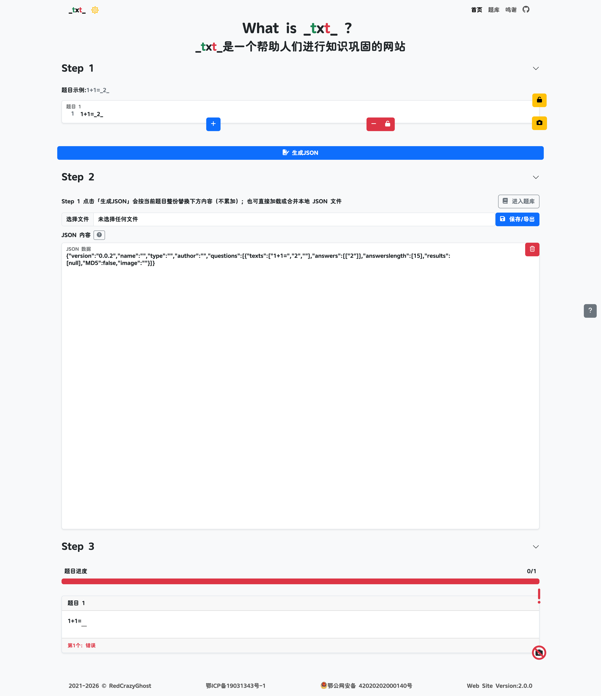

# \_txt\_

`_txt_` 是一个用于知识点整理与练习巩固的学习工具。

## 功能

- **题集编辑与导入**
  - 支持将笔记文本整理为题集
  - 支持导入/导出题集 JSON 文件，便于备份与分享
- **题库管理**
  - 支持本地题库管理（新增、编辑、删除、搜索）
  - 支持从内置网络题库下载到本地继续练习
- **做题练习**
  - 支持按题集开始练习
  - 支持题目结果记录与复盘
- **题集数据结构统一**
  - 采用 `QuestionJSON 0.0.2` 格式（`version/name/type/author/questions`）
  - 题集按类型目录组织：`QuestionJSON/<type>/`

## 目录说明

- `QuestionJSON/List.json`：题集类型索引
- `QuestionJSON/<type>/List.json`：类型下题集索引
- `QuestionJSON/<type>/*.json`：具体题集文件

## 页面展示

## License

本项目采用 [GPL-3.0 License](LICENSE) 开源协议。